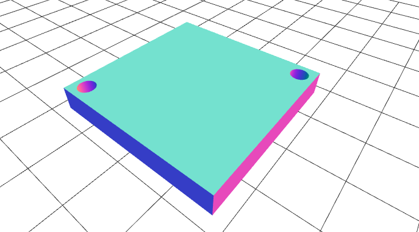

# PCB-Fixture-Generator

This a quick OpenSCAD-based repo for quick cli fixture generation.

## Motivation

Ever need to make a quick fixture/mount for a pcb, but didn't want to go through the repetitive tasks of MCAD'ing it up?

I'll be sharing my progress here for quick pcb-fixtures, right now with my preferred method of M2 screws and M2 brass inserts.

Just plug in the locations of the mounting holes, and the length/width of the board, and then you'll have STL ready to put onto the printer.

## How to use

To create an stl ready for 3D printing, enter the dimensions of the pcb and location of the cutouts for brass inserts:

```
openscad -o thing.stl -D "length=32;width=32;height=5;cx1=3;cy1=3;cx2=32;cy2=32" pcb_generator.scad 
```

See thing.stl for an example of output (can use github's stl viewer online)



## TODO

Things to add:

- tap insert screws option
- different sized brass inserts
- autoplaced mounts to 1inch x 1inch breadboard

## Notes

Amazed how easy it was to get this working ( less than 30minutes to learn syntax and cli flags).

contributors welcome, basic fork and pull request model and please share feedback via github issues.
